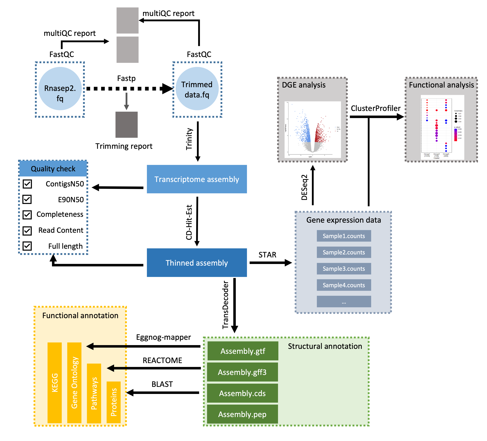

###########################################################################
#				RNAsep PROJECT				###
###########################################################################

Testing for transcriptomic effects of Hg x pCO2 on Sepia officinalis embryos and juvéniles (head tissues).

#######################################################
## Bioinformatic Tools and versions for data processing

### 1. Quality check:

FASTQC_v0.12.1	; MULTIQC_v1.14

### 2. Trimming:

Trimmomatic_v0.39

### 3. Assembling:

bowtie_v2.5.1	; samtools_v1.14	; Jellyfish_v2.3.0
Salmon_v1.10.1	; Python_v3.11.1	; Trinity_v2.15.1

### 3a. Assembly quality assessment (https://github.com/trinityrnaseq/trinityrnaseq/wiki):

-> ContigsN50: Trinity_v2.15.1

-> E90N50: Kallisto_v0.46.2	; Trinity_v2.15.1

-> Completness: BUSCO_v5.5.0

-> Full-length transcript analysis: BLAST_v2.16.0

